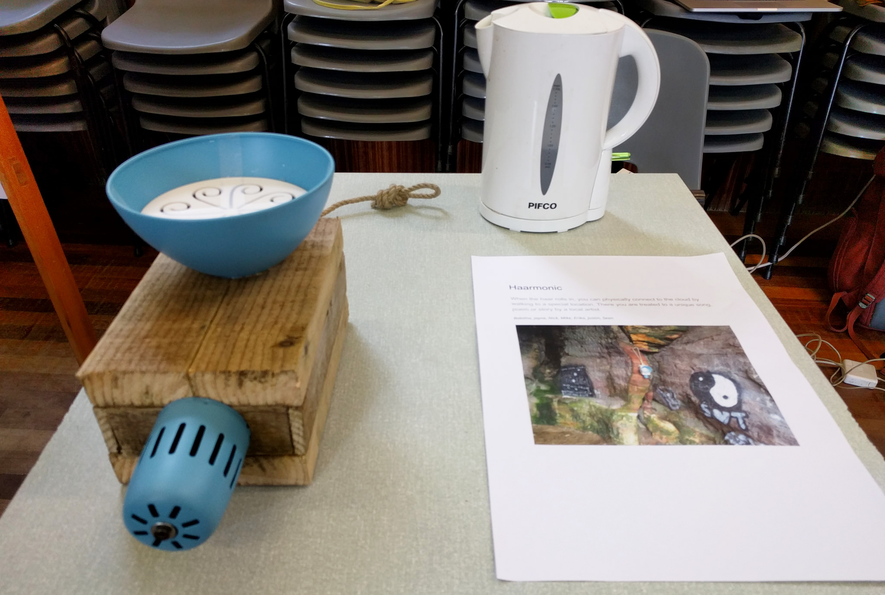
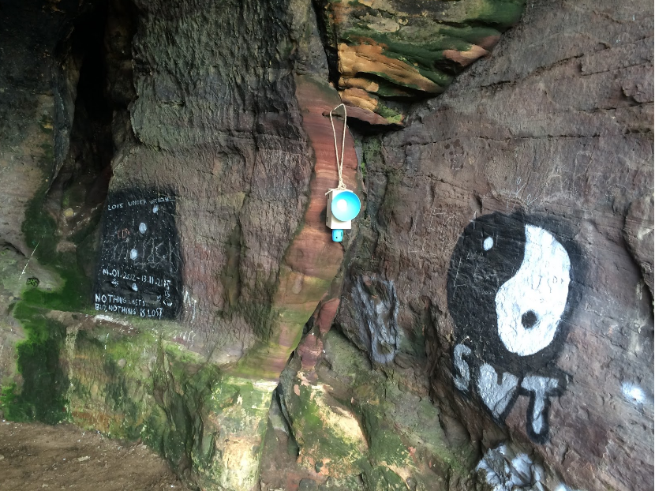

# Haarmonic

### When the haar rolls in, you can physically connect to the cloud by walking to a special location. There you are treated to a unique song, poem or story by a local artist.

*By Babitha George, Jayne Wallace, Nick Taylor, Mike Shorter, Erika Shorter, Justin Marshall, Sean at the Mozilla Open IoT Design Sprint in Anstruther, June 2016* 

